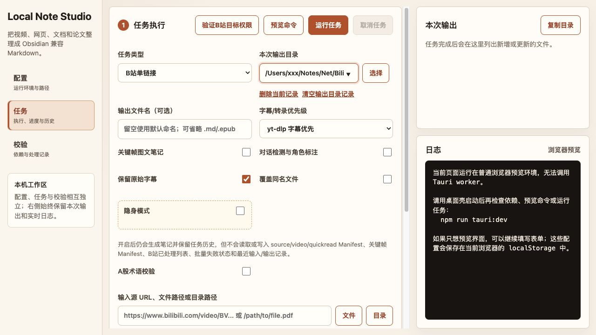

# Local Note Studio

Local Note Studio 是一款 **local-first 的 macOS 桌面笔记整理工具**，可以把 B 站视频与图文、网页、文档、论文、本地音视频和 AI 对话记录，转换成适合长期保存的 **Obsidian 兼容 Markdown**。

它把内容采集、字幕或语音转写、OCR、AI 整理、任务恢复和结果校验集中在一个桌面工作区中。笔记、配置、任务记录、缓存与索引默认保存在本机；需要模型处理时，内容会发送到用户自行配置的 OpenAI 兼容 API。

> 当前版本：`0.1.23`。项目仍处于内部测试阶段，现有 macOS 安装包采用临时签名，尚未完成 Developer ID 签名与 Apple 公证。

## 界面预览



任务工作区集中展示任务类型、处理选项、输入输出路径、执行控制以及实时日志。

## 主要功能

- **多来源统一整理**：支持视频、网页、Office/PDF、图片、论文、AI 对话和本地媒体。
- **结构化 Markdown 输出**：按任务保留来源信息、抽取原文或字幕，生成便于检索、引用和继续编辑的笔记。
- **字幕与语音转写**：B 站任务可选择 yt-dlp 字幕、网页字幕或 ASR；本地媒体支持同目录字幕与 Whisper ASR。
- **OCR 与多模态识别**：可处理图片和扫描型 PDF，并支持中断后续跑。
- **批量与增量处理**：支持收藏夹、系列、UP 主图文和本地目录批量任务；重复运行会识别已有完整结果。
- **可恢复的任务工作流**：提供实时日志、进度、取消、任务历史、失败项重试和输出完整性校验。
- **本机运行时管理**：桌面应用可以安装和修复独立的 Python、`yt-dlp`、`ffmpeg`、Whisper 运行库、ASR 模型与 Pandoc，无需改动系统 Python。

## 支持的任务

| 任务 | 输入 | 输出与说明 |
| --- | --- | --- |
| B 站单链接 | 视频 URL | 字幕/ASR 转写、AI 整理，可选关键帧和对话角色标注 |
| B 站收藏夹/系列 | 当前账号可访问的收藏夹或系列 | 批量生成笔记，单项失败不阻断其余任务 |
| B 站动态/充电动态 | 动态 URL | 抓取正文和图片后整理为 Markdown |
| B 站 UP 主图文批量 | UP 主 UID 或空间链接 | 分页发现图文内容并逐篇整理 |
| 微信公众号/网页 | 文章或网页 URL | 支持静态采集，也可使用指定浏览器会话处理登录或 JS 页面 |
| Word/PDF 整理 | 文件或目录 | 支持 `.doc`、`.docx`、`.pdf`、`.pptx`、`.xlsx`、`.csv`、`.html` 和图片等格式 |
| AI-Chat JSON | LM Studio 导出的 `.conversation.json` | 转换为 Markdown 对话笔记 |
| 论文速读 | 论文 PDF | 生成速读笔记并保留全文翻译 |
| 本地视频/音频 | 单个媒体文件或目录 | 字幕/ASR 转写并生成 Markdown，可递归处理目录 |
| 目录导出 EPUB | Markdown 目录 | 递归合并并导出单个 EPUB |

## 快速开始

### 使用 DMG 安装包

适合日常使用和测试。准备以下条件：

- macOS 12 或更高版本；
- 与 Mac CPU 架构匹配的 DMG（Apple Silicon 使用 `aarch64`，Intel 使用 `x86_64`）；
- 一个可访问的 OpenAI 兼容 API；
- 首次安装托管环境和默认 ASR 模型时可用的网络连接。

安装与首次运行：

1. 打开 DMG，将 **Local Note Studio** 拖入“应用程序”。
2. 启动应用，在“配置”中保留推荐的“应用托管环境”。
3. 填写 LLM API Base、API Key、模型名称和默认输出根目录。
4. 点击“安装/修复”，等待运行时、媒体工具和默认 ASR 模型安装完成。
5. 切换到“校验”，点击“检查依赖”。
6. 在“任务”中选择任务类型、输入源和输出目录，先“预览命令”，确认后运行。

内部测试包尚未公证。请先通过可信渠道核对 SHA-256，再使用右键或 Control-click →“打开”。具体版本、校验值和升级方式见 [macOS 发布说明](docs/release-macos.md)。

### 配置 B 站登录态（可选）

公开内容可以先尝试不配置 Cookie；私有收藏夹、充电内容或需要账号权限的字幕通常需要登录态。

1. 在已登录 B 站的 Chrome 中打开 `chrome://version/`。
2. 复制“个人资料路径”，并在应用中选择对应的末级 `Default` 或 `Profile N` 目录。
3. “B 站 Cookie 文件”可留空，应用会将筛选后的 B 站 Cookie 保存在自己的应用数据目录。
4. 点击“授权并刷新 Cookie”，随后在日志中确认登录态校验通过。

应用只读取用户明确选择的 Chrome Profile，并且只写出 B 站域名的 Cookie。更完整的权限说明和故障排查见 [中文操作手册](docs/user-guide-zh.md)。

## 界面工作流

桌面应用分为三个主要区域：

1. **配置**：选择托管环境或现有 Conda/Python，设置模型、ASR、Cookie 和默认输出路径。
2. **任务**：选择输入类型和处理选项，预览命令、运行或取消任务，并查看历史与恢复入口。
3. **校验**：检查依赖、浏览处理记录和 Manifest 状态。

右侧输出与日志面板会持续显示当前任务的命令、进度、警告和最终文件位置。建议先用一篇公开网页或一个小文档验证配置，再运行长视频或批量任务。

## 从源码开发

### 环境要求

- macOS 12+
- Node.js 20+
- Rust 工具链与 [Tauri 2 系统依赖](https://v2.tauri.app/start/prerequisites/)
- 应用托管环境，或兼容的 Python 3.10/3.11、Conda 与媒体处理环境

安装前端依赖并启动桌面开发模式：

```bash
npm install
npm run tauri:dev
```

`npm run tauri:dev` 会同时启动 Vite 和 Tauri 桌面窗口，只有桌面窗口可以调用 Worker。若只需预览前端界面，可运行：

```bash
npm run dev
```

浏览器预览模式不能检查依赖或执行笔记任务。开发机的路径、Cookie 和密钥应写入已被 Git 忽略的 `worker/env.local`：

```bash
cp worker/env.example worker/env.local
```

### 常用命令

```bash
# 构建前端
npm run build

# 运行前端、Python 与 Rust 全部检查
npm run check

# 检查发布配置
npm run release:check

# 构建 .app 与 DMG
npm run tauri:build
```

更完整的源码环境说明见 [环境配置](docs/environment.md)，打包流程见 [macOS 发布说明](docs/release-macos.md)。

## 技术架构

```text
Tauri 桌面界面（TypeScript / Vite）
  -> Rust 命令桥接与运行时管理
  -> Python Worker
  -> 下载、转写、OCR、内容整理脚本
  -> 本地 Markdown / EPUB 输出
```

- 前端负责配置、任务状态、进度、日志和历史交互。
- Rust 层负责桌面能力、Worker 进程管理、取消和托管运行时生命周期。
- Python Worker 负责参数校验、任务编排、结果检查和调用具体处理脚本。
- 修改型任务使用跨进程锁，避免桌面端、CLI 等入口同时写入相同状态。

详细进程模型和 Worker 合同见 [架构文档](docs/architecture.md)。

## 项目结构

```text
local-note-studio/
├── index.html                         # Vite 页面入口
├── package.json                       # 前端依赖、开发/构建/测试命令
├── src/                               # TypeScript 前端
│   ├── main.ts                        # 主界面、配置表单与任务请求组装
│   ├── app-shell.ts                   # 配置/任务/校验页签状态
│   ├── p1.ts                          # 任务历史、最近记录与结果解析
│   ├── manifest-state.ts              # Manifest 查看与编辑状态
│   └── styles.css                     # 桌面界面样式
├── src-tauri/                         # Tauri/Rust 桌面层
│   ├── src/main.rs                    # Worker 桥接、进程取消与托管运行时管理
│   ├── capabilities/default.json      # 桌面权限声明
│   ├── tauri.conf.json                # 窗口、资源和安装包配置
│   ├── Cargo.toml                     # Rust 依赖与包信息
│   └── icons/                         # 应用图标资源
├── worker/                            # Python 业务层
│   ├── local_note_studio_worker.py    # 统一任务入口、编排与结果校验
│   ├── automation_core.py             # 跨入口锁、任务执行与审计基础能力
│   ├── automation_profiles.py         # 受限 Profile 加载与校验
│   ├── local_notes_agent.py           # 高级 CLI 入口
│   ├── local_notes_retrieval.py       # 已有 Markdown 笔记索引与检索
│   ├── local_notes_mcp.py             # 可选 stdio MCP 适配层
│   ├── requirements-managed.lock      # 托管 Python 环境锁定依赖
│   ├── env.example                    # 源码开发环境变量示例
│   └── scripts/                       # 具体内容处理脚本
│       ├── run_bilibili_transcript.py # B 站和本地媒体任务入口
│       ├── bilibili/                  # 字幕发现、下载、ASR 与批量转写
│       ├── convert_sources_to_md.py   # 网页、Office、PDF、图片等转 Markdown
│       ├── qwen_organize_notes.py     # 通用 AI 笔记整理
│       ├── quick_read_pdf.py          # 论文速读与全文翻译
│       ├── export_epub.py             # Markdown 目录导出 EPUB
│       ├── export_bilibili_cookies.py # Chrome Profile 登录态导出
│       └── video_keyframes.py         # 视频关键帧提取
├── scripts/                           # 项目级命令入口
│   ├── dev-server.mjs                 # Vite 开发服务启动与清理
│   ├── release_check.py               # 发布前一致性检查
│   └── local-notes-*                  # 高级 CLI/MCP 启动包装器
├── tests/                             # 回归测试
│   ├── test_p1.mjs                    # 前端状态与兼容性测试
│   ├── test_worker.py                 # Worker 任务合同测试
│   ├── test_automation.py             # 自动化、锁与历史测试
│   ├── test_note_retrieval.py         # 笔记索引与检索测试
│   └── fixtures/                      # 测试输入与预期结果
└── docs/                              # 项目文档
    ├── user-guide-zh.md               # 中文操作手册
    ├── architecture.md                # 架构与 Worker 合同
    ├── environment.md                 # 环境、模型、ASR 与 Cookie 配置
    ├── release-macos.md               # macOS 构建、签名与测试交付
    ├── agent-automation.md            # 高级自动化说明
    └── assets/                        # README 等文档使用的图片
```

`dist/`、`node_modules/`、`src-tauri/target/`、`__pycache__/`、运行缓存和本机私有配置均为构建或运行时内容，不属于核心源码结构。

## 数据与隐私

Local Note Studio 采用本地优先设计，但不是完全离线应用：

- 输出笔记、任务状态、索引、缓存、Cookie 和模型设置保存在用户的 Mac 上。
- 托管运行时位于 `~/Library/Application Support/Local Note Studio/`，正常升级只替换 `.app`，不会删除该目录中的数据。
- 采集在线来源、下载运行时或 ASR 模型时需要联网。
- AI 整理与多模态 OCR 会把相关内容发送到用户配置的 OpenAI 兼容 API，数据策略取决于该服务提供方。
- 安装包不会包含个人 API Key、Cookie、笔记、索引或大型模型权重。

请勿提交 `worker/env.local`、Cookie 文件、真实密钥或个人输出目录。

## 高级扩展

项目也提供基于命名 Profile 的受限 CLI，可用于增量同步、失败重试、状态查询和已有笔记检索；需要接入支持 stdio 的本地 Agent 时，也可选用 MCP 入口。相关能力复用同一套 Worker，并限制可访问的来源、输出位置和参数范围。配置方式见 [Agent 自动化文档](docs/agent-automation.md)。

## 文档

- [中文操作手册](docs/user-guide-zh.md)：完整界面说明、各任务填写方式与常见问题
- [产品说明](docs/product.md)：产品目标、范围与当前非目标
- [架构文档](docs/architecture.md)：进程模型、运行时边界与 Worker 合同
- [环境配置](docs/environment.md)：托管环境、Conda、LLM、ASR 与 Cookie 配置
- [开发计划](docs/development-plan.md)：阶段目标与实现计划
- [待办事项](docs/todo.md)：当前优先级和验收标准
- [macOS 发布说明](docs/release-macos.md)：测试包、签名、公证与 clean-Mac 验收

## 当前限制

- 目前仅提供 macOS 桌面应用，Windows 与 Linux 尚未支持。
- LLM 与多模态 OCR 服务由用户自行配置，应用不内置本地大语言模型。
- 默认 ASR 模型在首次“安装/修复”时下载，不直接打包进 DMG。
- B 站内容可用性受账号权限、Cookie 状态和站点接口变化影响。
- Developer ID 签名、Apple 公证、Intel/Universal 正式包和独立 clean-Mac 全流程验收仍是公开发布前的门槛。
